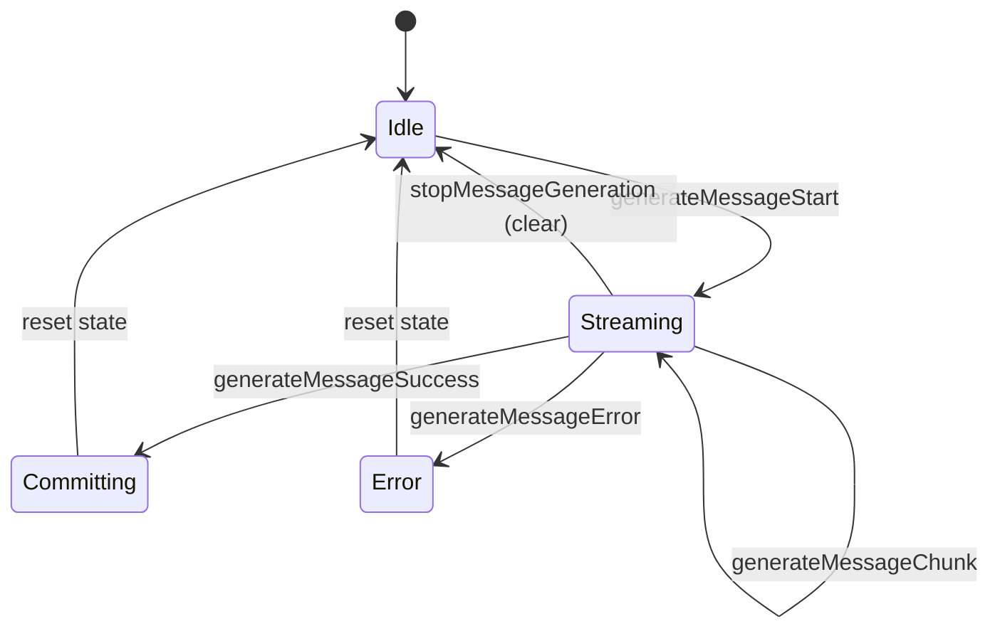

# Integrate New JSON Parser into Core Streaming

## Objective
Replace the legacy schema-coupled streaming JSON parser with the new pure streaming JSON parser and refactor core streaming to process raw LLM chunks, enabling reducer-driven parsing of structured output and tool arguments.

## Background
The existing streaming flow aggregates LLM chunks into a growing `AssistantMessage` in `generate-message.effects.ts` and relies on `StreamSchemaParser` in `models/internal_helpers.ts` to parse structured output/tool args. The new parser (`packages/core/src/skillet/parser/json-parser.ts`) is schema-agnostic, immutable, and AST-driven, and we want parsing to live in `streaming-message.reducer.ts` by feeding it raw chunks.

## Goals
- Fully remove the old parser (`packages/core/src/streaming-json-parser`) and its usage.
- Refactor streaming to emit raw `CompletionChunk`s rather than accumulated assistant messages.
- Maintain working structured output + tool call streaming using the new parser + `fromJsonAst`.
- Preserve current external behavior for non-streaming (finalized) messages.
- All tests and builds continue to pass.

## Non-Goals
- Transport/protocol changes (frames, decode logic, model selection, retries).
- UI/consumer changes outside core reducers/effects.
- Tool execution semantics (pending/done handling).
- Schema validation/coercion beyond `fromJsonAst`.
- Multi-stream/concurrent message streaming.
- Performance SLAs or telemetry beyond functional correctness.

## UX / Workflows
- Core effects emit raw streaming chunks.
- `streaming-message.reducer.ts` parses chunks into:
  - streaming assistant content (structured output or text)
  - streaming tool call arguments (for Hashbrown schemas)
- When generation finishes, reducer commits final resolved values to `messages.reducer.ts` and `tool-calls.reducer.ts`.
- For tools with non-Hashbrown schemas, parsing is deferred until the JSON AST is complete (no partial streaming updates).

```mermaid
flowchart TD
  A[generateMessageStart] --> B[Reset streaming state + snapshot config]
  B --> C[generateMessageChunk: CompletionChunk]
  C --> D[Merge tool call deltas]
  C --> E[Append content delta]
  D --> F[Parse tool arguments with JSON parser]
  E --> G[Parse structured output with JSON parser]
  F --> H[fromJsonAst resolve (Hashbrown tools)]
  G --> I[fromJsonAst resolve (response schema)]
  C --> C
  C --> J[generateMessageSuccess]
  J --> K[Commit final message/tool calls]
  J --> L[Reset streaming state]
  C --> M[generateMessageError]
  M --> L
```

## Data Model & API Changes

### Schema
Use the new parser state/AST from `packages/core/src/skillet/parser/json-parser.ts` and resolution via `packages/core/src/schema/from-json-ast.ts`.

### Identity-preserving internal state (new)
To preserve object identity in streaming and finalized views (per `design/core/json-parser.md`), internal state should store **both raw strings and resolved JSON values**:
- API payloads remain string-based (`content`, `toolCalls[].function.arguments`).
- Internal state stores identity-preserving resolved objects:
  - `Chat.Internal.AssistantMessage` gains `contentResolved?: JsonValue`
  - `Chat.Internal.ToolCall` gains `argumentsResolved?: JsonValue`

This allows reducers/selectors to emit stable object references for UI consumers while keeping API serialization unchanged.

### View conversion
`toViewMessagesFromInternal` should prefer resolved fields (if present) and fall back to raw strings when missing. This removes schema/parser knowledge from `internal_helpers.ts` once reducers populate resolved values.

### Streaming reducer state (proposed)
- `message: Chat.Internal.AssistantMessage | null`
- `toolCalls: Chat.Internal.ToolCall[]`
- `outputParserState?: ParserState`
- `outputCache?: FromJsonAstCache`
- `toolParserStateById: Record<string, ParserState>`
- `toolCacheById: Record<string, FromJsonAstCache>`
- `configSnapshot?: { responseSchema?: s.HashbrownType; emulateStructuredOutput: boolean; toolsByName: Record<string, Chat.Internal.Tool> }`

### Action payload changes
- `apiActions.generateMessageChunk` payload changes from `Chat.Api.AssistantMessage` to `Chat.Api.CompletionChunk`.
- `streaming-message.reducer.ts` becomes responsible for accumulating/deriving assistant/tool state from raw chunks.

### CompletionChunk shape (existing types)
Use the existing `Chat.Api.CompletionChunk` and related types from `packages/core/src/models/api.models.ts`:
- `CompletionChunk.choices: CompletionChunkChoice[]`
- `CompletionChunkChoice.delta.content?: string | null`
- `CompletionChunkChoice.delta.toolCalls?: DeepPartial<ToolCall>[]`
- `CompletionChunkChoice.delta.role?: string | undefined`
- `CompletionChunkChoice.finishReason: string | null`

Only the first choice (`choices[0]`) is used for streaming state updates, matching existing reducer/effect behavior.

Example (existing type shape):
```ts
const delta: Chat.Api.CompletionChunk = {
  choices: [
    {
      index: 0,
      delta: {
        role: 'assistant',
        content: 'Hello ',
        toolCalls: [
          {
            index: 0,
            id: 'call_1',
            type: 'function',
            function: { name: 'weather', arguments: '{\"zip\":' },
          },
        ],
      },
      finishReason: null,
    },
  ],
};
```

### Emulated structured output handling
- When `emulateStructuredOutput` is true and `responseSchema` is set, the API tool list includes the reserved `output` tool.
- The reducer must treat the `output` tool call as the structured output source:
  - Do not surface it as a tool call.
  - Parse its `arguments` with the structured output schema.
  - For non-emulated structured output, parse assistant `content` instead.

## Core Logic / Algorithms
1. **Snapshot config at generation start**
   - Capture `responseSchema`, `emulateStructuredOutput`, and tool schemas from `tools.reducer`.
   - Reset streaming state to `initialState` (single in-flight generation).
2. **Process each `CompletionChunk`**
   - Update per-tool call argument stream using the raw `toolCalls` deltas.
     - Merge strategy mirrors existing `mergeToolCalls` behavior in `packages/core/src/utils/assistant-message.ts`:
       - Tool calls are keyed by `index` and merged into a stable array.
       - `function.arguments` are concatenated as strings (`existing + delta`).
       - Other fields (id/type/name) are taken from the first complete delta seen.
   - Append `delta.content` to the streaming assistant content buffer.
   - For each Hashbrown tool schema, feed argument chunk text into new JSON parser state.
   - Resolve via `fromJsonAst(schema, state, cache)` and store cache.
   - Write resolved values into:
     - `message.contentResolved` for structured output
     - `toolCall.argumentsResolved` for tool args
   - For non-Hashbrown schema tools, parse via the new JSON parser but only emit resolved args once `ParserState.isComplete`.
   - Handle structured output parsing:
     - If `emulateStructuredOutput`: parse the `output` tool call's `arguments`.
     - Else parse assistant `content` stream.
3. **Finalize on `generation-finish`**
   - If parser error exists, defer error handling until finish (see Error Handling).
   - Commit fully resolved assistant message + tool calls to `messages.reducer.ts` and `tool-calls.reducer.ts`.
   - Resolved fields (`contentResolved`, `argumentsResolved`) are committed alongside raw strings to preserve identity in the view layer.
   - Discard AST/cache state.



## Error Handling
Define a clear taxonomy and reducer/effect responsibilities:
- **Transport/runtime errors** (network failures, provider errors):
  - Effect dispatches `generateMessageError` immediately.
  - Streaming reducer resets state on error.
- **JSON parsing errors** (invalid JSON in streaming AST):
  - Stored in streaming state as a parser error.
  - Emitted only on `generation-finish` to avoid transient errors mid-stream.
  - Effect dispatches `generateMessageError` after checking the streaming reducer state.
- **Schema resolution errors** (`fromJsonAst` errors when schema cannot resolve the AST):
  - Treated like parser errors: stored in state, surfaced at finish.

On `generation-finish`:
- If a parser/schema error exists, emit `generateMessageError` and skip `generateMessageSuccess` to avoid committing inconsistent structured output.
- If no error exists, emit `generateMessageSuccess` and commit final state.

## Telemetry / Observability
None.

## Backward Compatibility
- External API remains unchanged.
- Internal action payload change affects reducers and effect tests; update accordingly.
- Reserved tool name `output` remains enforced in `hashbrown.ts` (same validation and error messaging as today).
 - Internal model types expand to include resolved fields; API wire format remains string-based.

## Permissions / Security
- Pure JSON parsing only; no execution.
- Parser errors are contained in state and surfaced at completion.

## Rollout / Migration
1. Integrate new parser into streaming reducer.
2. Replace `StreamSchemaParser` usage in `models/internal_helpers.ts`.
3. Remove `packages/core/src/streaming-json-parser` and related exports.
4. Update tests and ensure green.

## Testing
- Update effect tests (`generate-message.effects.spec.ts`) to assert chunk payloads.
- Add/adjust reducer tests for:
  - streaming tool arguments (Hashbrown schema) across chunks
  - structured output via content vs output tool call
  - non-Hashbrown tool schema emits only at completion
  - deferred error handling on finish
- Additional edge cases:
  - UTF-8 split across chunk boundaries
  - JSON string escapes split across chunks
  - tool call deltas that arrive before tool metadata (name/id)
  - multiple tool calls interleaved across chunks
  - tool call deltas with no arguments (empty or null)
- Ensure existing schema parser interaction tests still pass.
 - Add coverage for identity preservation:
   - `contentResolved` object identity remains stable across successive chunks.
   - `argumentsResolved` object identity remains stable across successive tool arg chunks.

## Performance Considerations
- Streaming AST grows with total output size; this mirrors existing streaming behavior where the accumulated content grows linearly.
- `fromJsonAst` caching avoids full re-walks on every chunk; cache invalidation is not required when the AST mutates.
- Long-running streams may increase memory usage; reset on `generateMessageStart`/finish limits lifetime.

## Open Questions
- Do we want a distinct action for raw chunks instead of repurposing `generateMessageChunk`?
