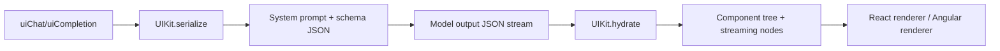

# Idea

Add a first-class UIKit instance option to uiChat/uiCompletion (React + Angular), alongside the exposed components list. The UIKit is responsible for serializing the component schema/config into JSON for the model and hydrating the streamed JSON output back into component trees. This would let teams customize schema serialization, handle migrations, or apply vendor-specific prompt/serialization tweaks without changing core rendering.

# Research

Hashbrown's generative UI model already defines a framework-agnostic component exposure model, schema generation, and rendering pipeline in core, with React/Angular adapters assembling schemas and rendering component trees based on component lists. This idea would centralize serialization/hydration responsibilities into a UIKit object rather than distributing them across each integration surface. See design context in `design/core/generative-ui.md`.

The streaming JSON parser work emphasizes immutability and identity preservation when parsing JSON into resolved values. A UIKit could standardize how that parser output is transformed into component nodes across frameworks, including fallback behavior during streaming, while keeping the immutable node identity contract intact. See `design/core/json-parser.md` and `design/core/json-parser-integration.md`.

# Sketch

